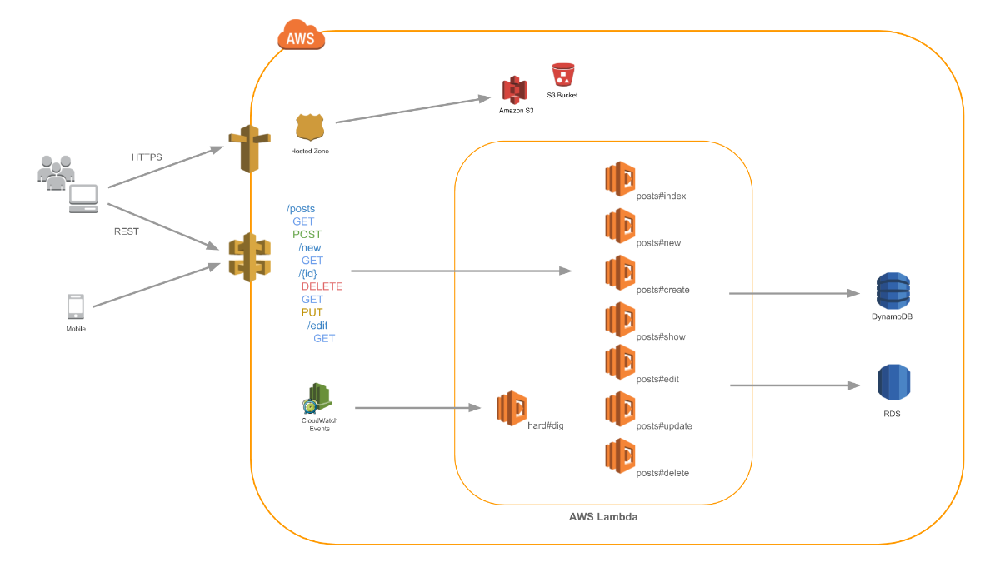

# Gifts List

This README would normally document whatever steps are necessary to get the application up and running.

## API
### Overview
The api was made with RubyOnJets. This framework is very similar to rails. In resume, RubyOnJets is "Rails running in an AWS Architecture".


### Getting Started

These instructions will get you a copy of the project up and running on your local machine for development and testing purposes. See deployment for notes on how to deploy the project on a live system.

To help run in terminal:
```
make help
```

#### Prerequisites
To develop and run api locally, you need to have installed ruby and postgresql in your machine.
For ruby, look at [rvm](https://rvm.io/) or [rbenv](https://github.com/rbenv/rbenv).
For postgres, look at [postgresql](https://www.postgresql.org/download/).
This api runs with ruby 2.5.5 .

#### Setup
Before all, run in terminal:
```
make setup
```
After this, you need to create a .env.development and .env.test files (see .env.sample file).

#### Running locally
After setup, run in terminal:
```
make run
```
After this, you can access the api in http://localhost:8888/.

#### Testing
To run tests, run in terminal:
```
make test
```
After run tests, you can check tests coverage in gifts-list-api/coverage/index.html or running the command `make test-cov` (in LINUX only).

To develop backend with TDD run:
```
make auto-test
```

### Deployment
TODO

### Contributing

* Only have to fork the project and make a pull request.

## Git Style

We use something like [Karma](http://karma-runner.github.io/1.0/dev/git-commit-msg.html) for commit messages.
Besides this, for new branchs use names in this format:
```
type/description
```
For example: to create a new branch that is responsible for create user permissions you must use feat/create-user-permissions.

## Versioning

We use [SemVer](http://semver.org/) for versioning.

## License

Not yet defined.

## Final Notes
Future improvements (TODO):
* Topic 1

Last worked branch: master

Doubts? Problems? send an email to magnunavf@gmail.com